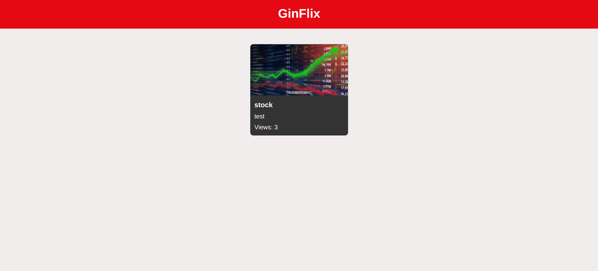
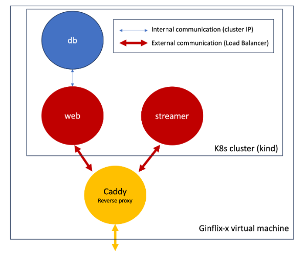

# GinFlix: Video on Demand application with Kubernetes

## Introduction
This project is a scalable Video on Demand (VoD) application designed for streaming video content through a web interface built with Django. The system architecture includes a PostgreSQL database for storing videos' metadata, an Nginx streamer server for video delivery, and a Caddy reverse proxy to unify access points. The entire infrastructure is deployed on a Kubernetes cluster, ensuring high availability, and scalability, with persistent storage for both the database and the streamer servers.

## Outline
- [Introduction](#introduction)
- [Outline](#outline)
- [1- Getting Started](#1--getting-started)
    - [1.1- Required Packages](#11--required-packages)
    - [1.2- Deploying the Service](#12--deploying-the-service)
        - [1.2.1- Creating the K8s Cluster](#121--creating-the-k8s-cluster)
        - [1.2.2- Starting the Server](#122--starting-the-servers)
        - [1.2.3- Copying a Test Vido to the Streamer](#123--copying-a-test-video-to-the-streamer)
        - [1.2.4- Adding the Video to the Web App](#124--adding-the-video-to-the-web-application)
        - [1.2.5- Cleaning](#125--cleaning)
- [2- System Architecture](#2--system-architecture)  
    - [2.1- Overview of the Architecture](#21--overview-of-the-architecture)
    - [2.2- Database Server](#22--database-server)
    - [2.3- Web Server](#23--web-server)
    - [2.4- Streaming Server](#24--streaming-server)
    - [2.5- Reverse Proxy](#25--reverse-proxy)
- [3- Implementation Details](#3--implementation-details)
    - [3.1- Postgres Database Server](#31--postgres-database-server)
    - [3.2- Django Web Server](#32--django-web-server)
    - [3.3- NGINX Streaming Server](#33--nginx-streaming-server)
    - [3.4- Caddy Reverse Proxy](#34--caddy-reverse-proxy)
- [4- References](#4--references)

## 1- Getting Started
### 1.1- Required Packages
We run the K8s cluster using Kind (Kubernetes in Docker), hence the first thing we need to have is Docker. Refer to this [Docker installation guide](https://docs.docker.com/engine/install/)  
Once Docker installed allow your user to run Docker:
```bash
sudo usermod -aG docker $USER
```
Then restart the terminal to take changes into account.  
Now we can install `kind` with the following commands:
```bash
curl -Lo ./kind https://kind.sigs.k8s.io/dl/v0.16.0/kind-linux-amd64
chmod +x ./kind
sudo mv ./kind /usr/bin/kind
```
Finally we need to have `kubectl` to communicate with the k8s cluster's control plane.
```bash
sudo snap install kubectl --classic
echo 'source <(kubectl completion bash)' >> ~/.bashrc
exec bash
```
### 1.2- Deploying the Service
In order to automate the process of creating the infrastructure, and launching the application, we use a Makefile that combine each set of related commands. This makes it very easy and fast to start or stop our application.
#### 1.2.1- Creating the K8s Cluster
```bash
make cluster-create
```
#### 1.2.2- Starting the Servers
```bash
make start
```
#### 1.2.3- Copying a Test Video to the Streamer
```bash
make copy
```
#### 1.2.4- Adding the Video to the Web Application
- Open the application at the address `http://localhost/admin`
- Login using the username:`admin@ginflix.com` and password:`admin`
- Use the menu tab `MAIN/Movies +Add` to add a new video
- In the Link entry write: `http://localhost/stream/stock.mp4`
- Fill the other entries with arbitrary information and press `Save`
- Now in the `http://localhost/` page you should see the new video you have just added, and clicking on it should start the video streaming

#### 1.2.5- Cleaning
```bash
make clean
```

## 2- System Architecture
### 2.1- Overview of the Architecture
The video on demand application is built on a scalable architecture comprising four main components: a PostgreSQL database server for storing video metadata, a Django-based web server for presenting the user interface and managing video information, an Nginx-based streamer server for delivering video content, and a Caddy reverse proxy to unify access to the web and streamer servers.


### 2.2- Database Server
The PostgreSQL database server is responsible for storing metadata about the videos available for streaming. It maintains information such as video titles, descriptions, and file locations. The web server interacts with the database server to read and write metadata, enabling users to add new video information and retrieve details such as the number of video views.
### 2.3- Web Server
The web server hosts a Django application that provides the user interface for the video on demand service. It allows users to add and manage video metadata and to view available videos. The web server communicates directly with the PostgreSQL database server to perform CRUD (Create, Read, Update, Delete) operations on video metadata. Additionally, it provides endpoints for the reverse proxy to access the web application.
### 2.4- Streaming Server
The streamer server runs an Nginx application that is responsible for serving the video content to users. Ideally we'd have more than one streamer server. Each streamer server handles video streaming requests by accessing the video files provided at a certain destination folder (`/var/www/html/`). It is the server responsible for delivering the video content to the end-users.
### 2.5- Reverse Proxy
The Caddy reverse proxy serves as the gateway for external access to the application. It listens to incoming requests and routes them to either the web server or the streamer servers based on the request path. By managing the external endpoint, Caddy ensures that users can interact with the web interface and stream videos from a single unified address, abstracting the internal server structure.

## 3- Implementation Details
### 3.1- Postgres Database Server
- **Implementation**: The PostgreSQL database server is implemented as a Kubernetes deployment. This deployment ensures that the database service runs consistently and can be scaled if necessary. The database itself is stored in a persistent volume to ensure data availability.
- **Deployment**: A Kubernetes service of type ClusterIP is used to provide internal network connectivity to the PostgreSQL database. This service allows the web server to communicate with the database.
- **Communication**: The web server communicates with the PostgreSQL database server through the Kubernetes service. This allows the web server to perform CRUD operations on the database, such as adding video metadata or retrieving information about available videos.
### 3.2- Django Web Server
- **Implementation**: The web server is implemented as a Django application running within a Docker container. The Docker container is then deployed as a Kubernetes deployment, ensuring that the web server can be easily managed and scaled.
- **Deployment**: A Kubernetes service of type MetalLB is used to expose the web server to external traffic, and to load balance the traffic among all the web server replicas. This service allows users to access the web interface of the video on demand application from outside the Kubernetes cluster.
### 3.3- Nginx Streaming Server
- **Implementation**: The streamer server is implemented as an Nginx application running withing a Docker container, that is then deployed as a Kubernetes deployment. A configMap is used in order to pass the default website configuration to the Nginx container
- **Deployment**: A Kubernetes service of type MetalLB is used to expose the streamer server to external traffic and to load balance the traffic among all the streamer servers. This service allows users to access the streaming functionality of the application from outside the Kubernetes cluster.
- **Communication**: The streamer server does not directly communicate with the other servers. Instead, it serves video content to users who request it through the web server. Users interact with the web interface provided by the web server, which in turn communicates with the streamer server to stream videos.
### 3.4- Caddy Reverse Proxy
- **Implementation**: The reverse proxy server is implemented as a Caddy server running within a Docker container. The Caddy server is configured to route incoming requests to the appropriate backend servers based on the request path.
- **Deployment**: The Caddy server is deployed as a standalone Docker container. It is not managed by Kubernetes but runs alongside the Kubernetes cluster
- **Communication**: The reverse proxy server does not directly communicate with the other servers. Instead, it acts as a middleman, routing incoming requests to the appropriate backend server based on the requested URL path. This allows users to access both the web interface and streaming functionality of the application through a single external endpoint.

## 4- References
- [Kubernetes training](https://gitlab.telecom-paris.fr/jean-louis.rougier/k8s-hands-on-training)
- [Kubernetes Up & Running book](https://www.oreilly.com/library/view/kubernetes-up-and/9781098110192/)
- [Web application Docker image](https://hub.docker.com/r/gintelecom/ginflix)